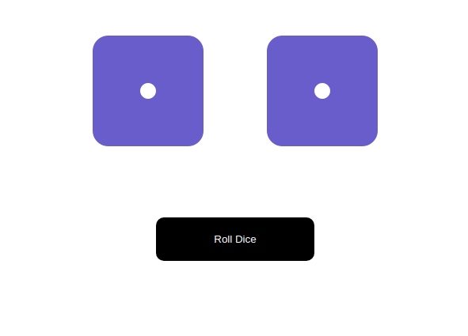

### Roll Dice

A simple React app using components, state, an array and defaultProps.
The roll method can pick a random element from the array for each die, then update the state, causing the dice to re-render to the appropriate values.

